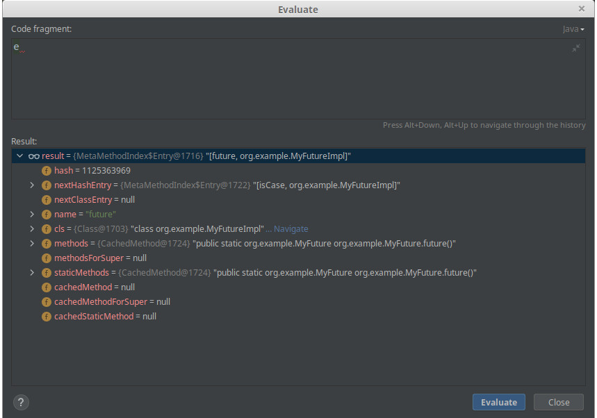

#### Issue:
Groovy code returns non-deterministic - or at least unexpected - results.

#### Reproduce steps:
1. Run `MainGroovy` & observe results (probably `true` but it may vary)
1. Uncomment a single line as noted in `MainGroovy` (this somehow helps to change the result; if it's not enough please add additional println or move code to a helper method)
1. Run `MainGroovy` & observe results (probably `false` but it may vary)

#### Partial analysis:
1. At some point during object creation `MetaClassImpl.getMethodWithCachingInternal` gets called.
1. Set breakpoint after `MetaMethodIndex.Entry e = ...`
1. `e.methods.cachedMethod` sometimes finds `MyPromise.future()` to be later used as a pojo constructor (valid), and sometimes `MyFuture.future()` (invalid)
  
  
1. Depending on above the code `p == p.future()` compares either references of a single instance (as expected) or different instances (unexpected)

 
#### Env:
 - Groovy 3.0.6 (project dependency)
 - JVM   
    ```
    $ java -version
    openjdk 11.0.7 2020-04-14
    OpenJDK Runtime Environment AdoptOpenJDK (build 11.0.7+10)
    OpenJDK 64-Bit Server VM AdoptOpenJDK (build 11.0.7+10, mixed mode)
    ```

#### Run:
From IDE or cmd: `./gradlew clean shadowjar && java -jar build/libs/groovy-instances-equality-1.0-SNAPSHOT.jar`

#### Final note:
This example repo models how basic blocks of [Vertx](https://vertx.io/) 3.9.* - `Promise` and `Future` - are tied together. And how it does not go along with Groovy.
 
Some initial digging was done here: https://github.com/vert-x3/vertx-lang-groovy/issues/113
